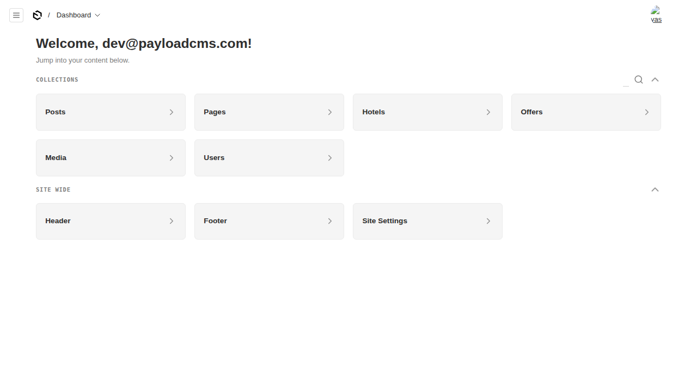

# @foundrykit/payload-admin-ui

A polished, **data-driven dashboard** for the [Payload CMS 3](https://payloadcms.com) admin panel. Replaces the stock dashboard with a friendly welcome header plus **searchable Collections** and **Globals** overviews that read straight from your config and respect each user's permissions.

Extracted from the Turquoise admin and de-branded: the original relied on a project-specific Tailwind theme, so the styling has been rewritten to use Payload's own admin CSS variables — it looks right in light or dark mode, in any project, with no Tailwind required.

## Features

- **Welcome widget** — greets the signed-in user by name (falls back to email).
- **Collections overview** — a responsive card grid of your collections, with a slide-out **search** to filter, and a collapsible section header. Internal `payload-*` collections are hidden, and only collections the user can access are shown.
- **Globals overview** — the same, for your globals.
- **Zero config** — drop the plugin in and the dashboard reflects whatever collections/globals you have. Toggle any section off if you don't want it.
- **Theme-native styling** — uses `--theme-elevation-*` / `--theme-text` variables, so it matches the admin and adapts to light/dark automatically. No Tailwind, no brand tokens.

## Screenshot



---

## Installation

```sh
pnpm add @foundrykit/payload-admin-ui
```

Peer deps: `payload`, `@payloadcms/ui`, `react`. `@radix-ui/react-collapsible` and `lucide-react` ship as dependencies.

Run `payload generate:importmap` after adding it (automatic on dev/build) so the widgets are registered.

## Usage

```ts
// payload.config.ts
import { adminDashboardPlugin } from '@foundrykit/payload-admin-ui'
import { buildConfig } from 'payload'

export default buildConfig({
  plugins: [adminDashboardPlugin()],
  // …
})
```

That's it — the dashboard picks up your collections and globals automatically.

## Configuration

```ts
adminDashboardPlugin({
  welcome?: boolean          // welcome widget, default true
  collections?: boolean      // collections overview, default true
  globals?: boolean          // globals overview, default true
  setDefaultLayout?: boolean // set admin.dashboard.defaultLayout, default true
  disabled?: boolean
})
```

The plugin registers its widgets under `admin.dashboard.widgets` and (by default) sets `admin.dashboard.defaultLayout`. It **appends** to any widgets you've already registered, so your own dashboard widgets are preserved — set `setDefaultLayout: false` to keep a custom layout and only add these widgets to the palette.

## How it works

Payload 3's dashboard is composed of widgets (`admin.dashboard.widgets`). This plugin ships three server widgets:

- `fk-welcome` → the greeting,
- `fk-collections` → reads `req.payload.config.collections`, filters by `permissions`, resolves labels (including i18n label functions), and renders the searchable grid,
- `fk-globals` → the same for globals.

Because the data comes from the live config + permissions at render time, there's nothing to keep in sync.

## Exports

- `@foundrykit/payload-admin-ui` — `adminDashboardPlugin`, `AdminDashboardConfig`.
- `@foundrykit/payload-admin-ui/rsc` — the server widgets (registered via the import map).
- `@foundrykit/payload-admin-ui/client` — the client grid/section components, if you want to compose your own dashboard.

## Development

```sh
pnpm install
pnpm dev          # dev admin at http://localhost:3000/admin — seeded with demo collections + globals
pnpm test         # unit + integration + e2e
pnpm test:unit    # plugin wiring (widgets, layout, toggles)
pnpm test:int     # widgets registered on a real Payload instance
pnpm build && pnpm verify:pack
```

## License

MIT © Isaac SJ / Umi
